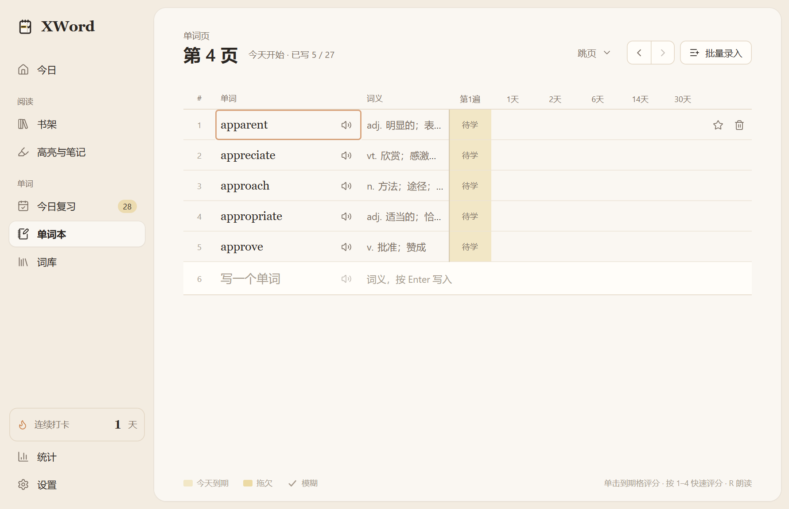

[简体中文](README.zh-CN.md) · English

# Vocabulary-Tracker-XWord

**A Windows desktop app connecting English reading with vocabulary collection and scheduled review.**
The application remains **XWord**; this repository presents version **0.4.1**.

## Value

Looking up a word is easy; keeping its context and returning to it later is harder.
XWord connects the book, sentence and review record in one local workflow:
**read → collect → review → meet the word again in the book**.
This is a personal software project for English reading and vocabulary practice, with a Chinese UI.

## Contribution

The project implements an integrated desktop product:

- EPUB/TXT reading and selectable-text PDF support, with navigation, highlights and notes.
- Offline lookup, selectable meanings, collection with original sentences and jumps back to the book.
- A 27-word notebook grid and scheduled reviews: overdue handling, retries, undo and difficult words.
- Shared local English pronunciation, optional streaming translation, local storage and Windows packaging.

The implementation demonstrates desktop/UI engineering, document parsing, explicit domain rules,
cross-process validation and automated verification. These are implementation contributions;
the project does not claim a new learning algorithm or measured improvement in memory retention.

## Methods

- **Stable text anchors:** positions and annotations use text locations instead of layout-dependent page numbers.
- **Rules separated from storage:** pure scheduling functions compute outcomes; the main process validates and persists them.
- **Two review queues:** daily work derives from saved data; session retries do not overwrite the formal review result.
- **Bounded document handling:** imported content becomes controlled structures; networking and file access stay in the main process.

See [architecture and data flow](docs/ARCHITECTURE.md) for module relationships and storage boundaries.

## Evidence

The unchanged application passed **213 unit tests across 29 files** and **72 real-window scenarios**
on Windows during publication preparation: collection, grading/undo, EPUB/PDF reading, annotations,
persistence and pronunciation controls. AI/network scenarios use local mocks; pronunciation control
tests do not prove audible quality. See [verification and limitations](docs/VERIFICATION.md).



[Reading screenshot](docs/images/reader.png) · [Home screenshot](docs/images/home.png)

Screenshots show the running app with synthetic test data, not design mockups.

## Quick start

**Rights:** publicly viewable, all rights reserved. No open-source license or permission to use or
modify the original project is granted. These commands are for the owner and separately authorized
users. Read [NOTICE.md](NOTICE.md) before use.

Verified: **Windows 11 x64, Node.js 22.23.2, npm 10.9.8, Git and PowerShell**.
The local core needs no Python, Rust, C++ toolchain, API key or database server.
Window tests need an interactive desktop; other platforms are not verified.

```powershell
git clone https://github.com/Sean-xzx/Vocabulary-Tracker-XWord.git
cd Vocabulary-Tracker-XWord
npm ci
node scripts/verify-repository.mjs
npm run dev
```

Expected: a Chinese XWord window opens on the home page with no books or words on first use.
The dictionary is included, and the app initializes its database automatically.

**Small example:** import [demo.txt](docs/examples/demo.txt) from the bookshelf, open it,
click `ability`, choose a meaning and collect it. Expect one notebook word with a sentence/source;
the source jumps back to the book. Start today's review, reveal and grade the answer.
Expect a first-review record; restart to confirm persistence. Pronunciation requires a local English OS voice.

## Development and reproduction

```powershell
npm run typecheck
npm run test
npm run lint
npm run e2e
npm run build
```

Expected: successful checks, `72` passing window scenarios and `release/XWord-Setup-0.4.1.exe`.
Installers are unsigned; no byte-identical build claim is made.
[Windows CI](.github/workflows/ci.yml) runs these and repository/resource checks.
See [setup, configuration and troubleshooting](docs/DEVELOPMENT.md) for data paths, isolated tests,
optional DeepSeek setup and network requirements; [resource manifest](docs/resources.json) records checksums.

## Project map

| Path                      | Role                                                                           |
| ------------------------- | ------------------------------------------------------------------------------ |
| `src/main/`               | Startup, IPC validation, SQLite, books, dictionary, network and encrypted keys |
| `src/preload/`            | Typed window.xword bridge                                                      |
| `src/shared/`             | API types, scheduling, dates and document/text algorithms                      |
| `src/renderer/src/`       | React features, Zustand state, common UI and pronunciation                     |
| `scripts/`                | Window tests, dictionary tools, repository and design checks                   |
| `resources/`, `build/`    | Dictionary/license and Windows packaging assets                                |
| `docs/`, `design-assets/` | Documentation, examples, evidence and design references                        |

Entrypoints: [main](src/main/index.ts), [preload](src/preload/index.ts),
[renderer](src/renderer/src/main.tsx). [Architecture](docs/ARCHITECTURE.md) explains their collaboration.

## Status and limits

Personal project; no release cadence or support SLA. Statistics is a placeholder.
Scanned PDF/OCR, DRM books, cloud sync and automatic updates are not implemented.
English voice availability varies. Live DeepSeek billing/answers and real Gutenberg downloads were
not revalidated during publication; DeepSeek may charge your account.
Daily backups cover the database, not books or all preferences. Existing PDF Hooks and build/runtime
warnings are recorded in [verification](docs/VERIFICATION.md).
Restrictive Windows Application Control can block local NSIS packaging.
The existing dependency audit reports 12 affected entries (4 high, 8 moderate); these remain unresolved.

Report reproducible bugs through [Issues](https://github.com/Sean-xzx/Vocabulary-Tracker-XWord/issues),
without keys, private books or learning databases. Permission requests go to
[Sean-xzx](https://github.com/Sean-xzx). Reporting bugs does not grant modification permission.

## Rights and acknowledgements

Original materials: **all rights reserved; no open-source license**.
GitHub's platform viewing/forking rights remain applicable; public visibility cannot prevent copies.
Third-party licenses remain intact, including the bundled ECDICT MIT notice.
See [rights](NOTICE.md), [third-party sources](THIRD_PARTY_NOTICES.md),
[change history](docs/CHANGELOG.md) and [design decisions](docs/DECISIONS.md).
