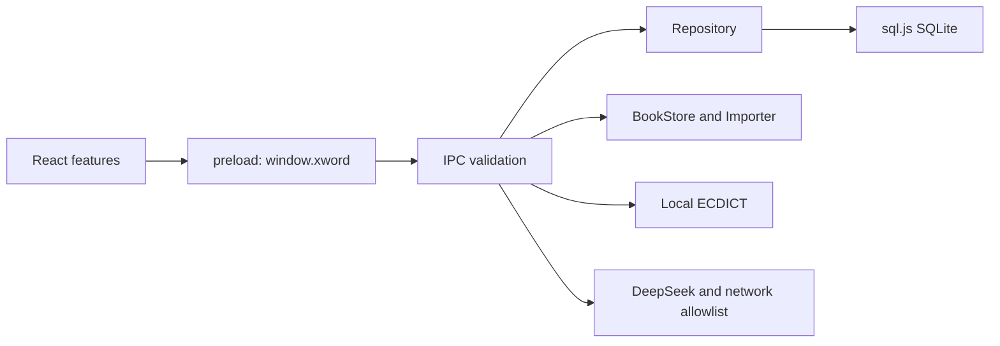

# Architecture / 架构

XWord is a local Windows desktop application. React renders the UI; Electron's main process
owns files, SQLite, network access and encrypted secrets. No account or cloud synchronization
is implemented. The repository name differs from the application name intentionally.

XWord 是本地 Windows 桌面软件。React 负责界面，Electron 主进程负责文件、数据库、联网和加密密钥；
没有账户和云同步系统。仓库名与软件名不同是有意保留原软件身份。

## Entrypoints / 入口

- [main startup](../src/main/index.ts): single-instance lock, backups, migrations, services and window.
- [preload](../src/preload/index.ts): bounded typed calls and event subscriptions; includes caller timezone.
- [renderer startup](../src/renderer/src/main.tsx) and [App](../src/renderer/src/App.tsx): startup UI and navigation.
- [shared API](../src/shared/api.ts): cross-process types and channel names.
- [Repository](../src/main/db/repository.ts): data operations and SQL-to-domain conversion.
- [scheduler](../src/shared/domain/scheduler.ts) and [queue](../src/shared/domain/queue.ts): pure review rules.
- [reader shell](../src/renderer/src/features/reader/ReaderView.tsx): common reading interactions.
- [page engine contract](../src/renderer/src/features/reader/engine.ts): EPUB/TXT and PDF use separate renderers.
- [speech](../src/renderer/src/lib/speech.ts): shared local English speech synthesis.

## Data flow / 数据流

Adding a word: entry UI or reader lookup → selected dictionary senses → preload → validated IPC
→ Repository → placement algorithm → SQLite transaction → file persistence → refreshed Zustand snapshot.
Reading collection also creates a `word_sources` entry containing the book, sentence and anchor.

录入或阅读收词经过义项选择、预加载桥和参数校验，再由数据库层按页分配并保存；
界面刷新快照。阅读收词同时保存原句和书中锚点，重复收词可追加出处。

Review: snapshot → today's derived queue → in-memory session → grading plan → checks, word state
and review log. Stages are `[0, 1, 2, 6, 14, 30]` days from the first learning date, not the last review.
Grades 1/2 reappear within the session. Retries only add log entries, without changing checks or lapses.
Undo restores both grading state and associated records. The unfinished retry queue is not persistent.

复习节点从首次学习日计算。今日队列可以从持久化数据重算，本轮重现队列只在内存。
重现不重复改写节点结果和错误次数；撤销恢复相关状态和记录。

Book import: main checks size, hashes and archive limits; renderer parses EPUB DOM or PDF metadata;
main validates and commits. TXT/EPUB render normalized structures using React, never imported HTML.
PDF uses pdf.js canvas and selectable text. Layout-dependent page numbers are temporary; persistent
positions, sources and highlights use chapter/block/text offsets (PDF page/text offsets).

书籍导入在主进程和界面协作完成。EPUB/TXT 使用受控结构渲染，PDF 使用画布与文字层。
位置保存正文锚点，不依赖当前字号下的页码。

AI: selection → main request with encrypted key → allowlisted HTTPS → request-specific stream events
→ result cache. Tests use a local mock; real DeepSeek access is optional and may cost money.

AI 翻译由主进程请求，界面接收流式事件；测试使用模拟服务，不需要私人密钥。

## Storage and boundaries / 存储与边界

| Storage                         | Contents / 内容                                                                                                                      |
| ------------------------------- | ------------------------------------------------------------------------------------------------------------------------------------ |
| `userData/xword.db`             | Words, pages, checks, review logs, settings, books, reading logs, sources, known words, highlights and translations / 学习与阅读记录 |
| `userData/books/<id>/`          | Metadata, TOC, EPUB/TXT chapters, images and original book files / 正文与原文件                                                      |
| `userData/secrets/deepseek.key` | Encrypted key, not returned to renderer / 加密密钥                                                                                   |
| localStorage                    | Interface and per-book layout preferences / 界面偏好                                                                                 |
| memory                          | Current review session and derived caches / 当前复习会话与缓存                                                                       |

Daily backups keep seven database copies; pre-migration copies are separate. They do not back up
book files, secrets or all UI preferences. Database transactions commit in memory before persistence;
a post-commit disk error is not the same as rolling back the SQL transaction. Book file replacement
and database updates are not a cross-storage atomic transaction.

每日备份只包含数据库，保留七份；迁移前备份另存。完整恢复需另行备份整个用户数据目录。
数据库内存提交和磁盘落盘、书籍文件与数据库提交，都有不同的边界。

Security uses context isolation, renderer sandboxing, strict CSP, validated IPC, network allowlists,
SVG cleanup and import limits. These are implementation controls, not a claim of a security audit.
Historical project rationale is in [DECISIONS](DECISIONS.md); collaboration rules are in [CLAUDE](../CLAUDE.md).
